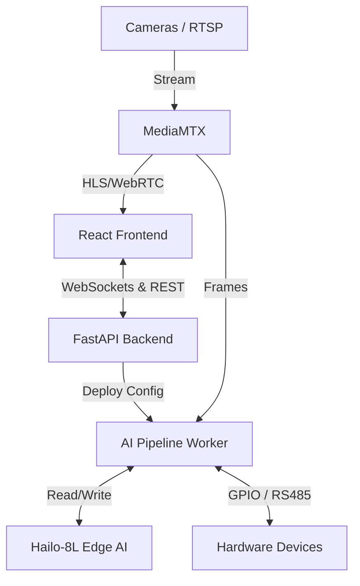

# IRIV Vision Studio 🚀

**IRIV Vision Studio** is a powerful, node-based Edge AI Vision platform designed specifically for industrial automation and edge computing (e.g., Raspberry Pi with Hailo-8L accelerators). It allows users to visually design, deploy, and monitor real-time AI pipelines through an intuitive drag-and-drop interface, bridging the gap between hardware (GPIO, RS485), computer vision models (YOLO, custom `.hef`), and logical edge processing.

---

## 📸 Screenshots
> **Note:** Add actual screenshots of the application here.


---

## ✨ Key Features

### 🧩 Node-Based Pipeline Builder
- **Visual Programming:** Build complex video processing pipelines using `@xyflow/react` without writing a single line of code.
- **Node Types:** 
  - **AI Nodes:** Object detection, classification using Hailo models (`.hef`).
  - **Hardware Nodes:** Digital Input/Output, LED, Buzzer, RS485 integration.
  - **Logic & Flow Nodes:** Rate limiters, conditional logic, custom python function nodes.
  - **Dashboard & Debug Nodes:** Direct output to dashboard widgets and websocket debuggers.

### ⚡ High-Performance Edge AI Backend
- **Hailo Integration:** Optimized inference using `hailort` for real-time edge processing (YOLOv8, Custom models).
- **Stream Management:** Efficient video stream ingestion and distribution via **MediaMTX** (RTSP, WebRTC, HLS).
- **Hardware Daemon:** Native interaction with Raspberry Pi GPIO and serial communication protocols.
- **FastAPI Core:** Robust RESTful and WebSocket API connecting the AI engine with the frontend UI.

### 📊 Real-Time Interactive Dashboard
- **Customizable Layout:** Grid-based (`react-grid-layout`) dashboard for live monitoring.
- **Widgets:** Live video feeds (WebRTC/HLS), text feeds, real-time metrics (`recharts`), and system logs.
- **Global State Management:** Low latency updates powered by `zustand`.

---

## 🏗️ System Architecture



---

## 🛠️ Technology Stack

**Frontend:**
- **Framework:** React 19, Vite
- **Styling:** Tailwind CSS 4, Lucide React Icons
- **State & Flow:** Zustand, React Flow (`@xyflow/react`)
- **UI Components:** React Grid Layout, Recharts

**Backend:**
- **Framework:** Python 3.11+, FastAPI, Uvicorn
- **AI / Vision:** HailoRT, OpenCV
- **Hardware:** `RPi.GPIO`, Serial (RS485)
- **Media Routing:** MediaMTX (RTSP / RTMP / HLS / WebRTC)

---

## 📂 Project Structure

```text
iriv-vision-studio/
├── backend/                  # Python API, AI Worker, Hardware interaction
│   ├── ai_engine/            # Pipeline parser, Hailo inference worker, Message Router
│   ├── db/                   # Project and entity definitions (JSON database)
│   ├── hardware/             # GPIO and RS485 manager scripts
│   ├── mediamtx/             # MediaMTX binaries and configs for stream routing
│   ├── models/               # Hailo HEF model files (.hef)
│   ├── web_server/           # FastAPI main app and WebSocket managers
│   └── requirements.txt      # Python dependencies
├── frontend/                 # React UI application
│   ├── src/
│   │   ├── components/       # UI Components (PipelineBuilder, DashboardWidgets, Settings)
│   │   ├── store/            # Zustand global state (usePipelineStore.js)
│   │   └── index.css         # Tailwind global styles
│   └── package.json          # Node dependencies
└── start.sh                  # One-click startup script (concurrent execution)
```

---

## 🚀 Getting Started

### Prerequisites
- **Node.js** (v18 or higher)
- **Python** (v3.11 or higher)
- **Hardware (Optional but recommended):** Raspberry Pi 4/5 with a Hailo AI Accelerator module.
- **HailoRT:** Ensure Hailo drivers and PCIe configurations are properly set up on the host machine.

### Installation

1. **Clone the repository:**
   ```bash
   git clone https://github.com/your-username/iriv-vision-studio.git
   cd iriv-vision-studio
   ```

2. **Frontend Setup:**
   ```bash
   cd frontend
   npm install
   ```

3. **Backend Setup:**
   ```bash
   cd ../backend
   python3 -m venv venv
   source venv/bin/activate
   pip install -r requirements.txt
   ```

### Running the Application

IRIV Vision Studio comes with a handy script that concurrently starts the **Frontend**, **FastAPI Backend**, and **MediaMTX** Server.

```bash
chmod +x start.sh
./start.sh
```

**Services Started:**
- **Frontend UI:** `http://localhost:5173`
- **FastAPI Backend:** `http://localhost:8000`
- **MediaMTX Stream Server:** Routing on ports `8554` (RTSP), `8889` (WebRTC), etc.

---

## ⚙️ Configuration & Environment
You can configure environment variables by creating a `.env` file in the `backend` directory:
```ini
# backend/.env
HOST=0.0.0.0
PORT=8000
MEDIAMTX_API_URL=http://localhost:9997
HAILO_DEVICE_ID=0000:01:00.0
```

---

## 🚑 Troubleshooting
- **Hailo PCIe Device Not Found:** Ensure the HailoRT driver is installed and the device is detected via `lspci | grep Hailo`.
- **MediaMTX Streams Failing:** Check if port `8554` or `8889` is already in use.
- **WebSocket Disconnects:** Ensure the frontend points to the correct backend IP if accessing from a different machine on the local network.

---

## 🔧 Workflow Guide

1. **Create a Project:** Start by creating a new project in the Home Screen.
2. **Build a Pipeline:** Go to the Pipeline Builder, drag an `Input Node` (e.g., Camera stream), connect it to an `AI Node` (select a model like YOLOv8), and route the output to a `Dashboard Video Node` or `Hardware Node` (e.g., Digital Output / LED).
3. **Set ROIs (Region of Interest):** Double-click AI nodes to define specific inspection zones on the stream.
4. **Deploy & Monitor:** Hit "Save & Deploy". Switch to the **Live Dashboard** tab to monitor inferences, latency, and hardware trigger events in real-time.

---

## 📝 Development Progress & Roadmap

### ✅ Completed
- [x] **Native compatibility and integration with IRIV EdgeAI platform/hardware**
- [x] Seamless IRIV Model Studio local compile flow (`/api/upload-hef`)
- [x] Node-based Pipeline Builder core functionality
- [x] Integration with Hailo-8L Edge AI accelerators
- [x] MediaMTX RTSP/WebRTC stream routing and management
- [x] Hardware Integration (Raspberry Pi GPIO, Digital I/O, LED, Buzzer)
- [x] Live Dashboard with WebRTC Video and Metric widgets
- [x] Real-time Node-level Debugging via WebSockets
- [x] ROI (Region of Interest) Editor for AI Nodes
- [x] Advanced logic nodes (Function Node, Rate Limit Node)
- [x] Enhanced stream quality auto-adjustments (`stream_quality.py`)
- [x] Extended hardware protocol integrations (RS485)

### 🚧 In Progress (WIP)
- [ ] Export pipeline configurations to standalone Docker containers
- [ ] [Optional] IRIV Cloud telemetry & sync integration

### 🛡️ Offline-First & Air-Gapped Capabilities (Roadmap)
- [ ] **Local Data & Image Storage Architecture:**
  - **SQLite (WAL Mode):** On-device, zero-setup database for high-speed logging of inference metadata (JSON) and system events.
  - **Filesystem Snapshot Storage:** Storing image snapshots directly to the local filesystem (with file paths saved to SQLite) to minimize SD card wear and maintain database performance.
- [ ] **Zero-Touch USB Auto-Deploy:** Auto-load pipelines and models via USB stick for mass deployment without UI interaction.
- [ ] **Physical & Local Alerts:** Direct GPIO Tower Light controls, local network Modbus TCP, and SMS module integration (no internet required).
- [ ] **Local Access Point (Hotspot):** Built-in AP mode for direct tablet/laptop connection without factory Wi-Fi.
- [ ] **mDNS Discovery (`iriv.local`):** Local network auto-discovery.
- [ ] **Air-Gapped Firmware Updates:** Upload `.tar.gz` system updates directly via the Web UI.
- [ ] **Self-Hosted Documentation:** Fully offline, bundled interactive tutorials and node documentation.

### 📅 Future Work
- [ ] **User Management & RBAC (Role-Based Access Control):**
  - **Multi-tier roles (Admin, Operator, Viewer):** Admins have full access, Operators can acknowledge alerts and view dashboards but cannot edit pipelines, and Viewers have read-only access.
  - **Audit Logging & Accountability:** Track user actions such as pipeline modifications, system overrides, and alert acknowledgments for factory compliance.
  - **Personalized Dashboards (Layouts):** Save distinct widget layouts per user account (e.g., Admins see system resources, Operators see video feeds).
  - **Targeted Alert Routing:** Dispatch alerts via Line/Email to specific users based on their roles, shifts, or assigned production lines.
  - **Multi-Tenancy / Workspaces:** Isolate projects and pipelines between different departments (e.g., QC team vs Security team).
  - **Secure API Integration (API Keys):** Require user-bound API Keys for external system (SCADA/ERP) integrations to prevent unauthorized access.
- [ ] Support for multi-camera parallel pipeline execution
- [ ] Modbus Industrial Protocol integrations

---

## 📜 License
*Specify License Here (e.g., MIT, Apache 2.0)*
